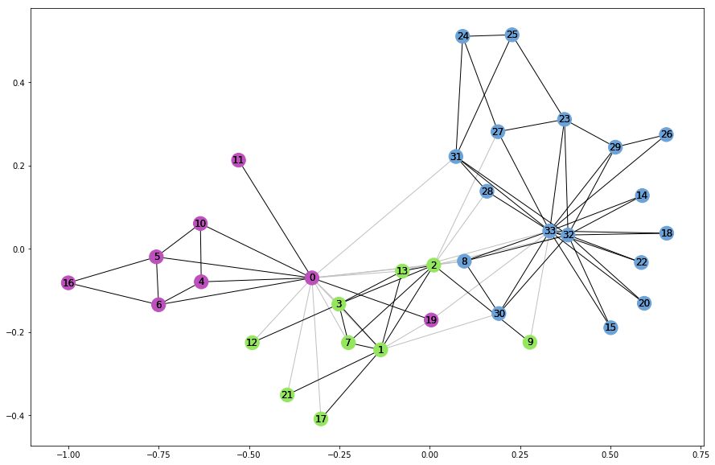

# Eigenvector Community Detection
This project focuses on community detection in networks using the leading eigenvector algorithm. The goal is to identify communities or groups of densely connected nodes within a given network graph. The algorithm iteratively removes edges with high edge betweenness centrality until the graph becomes disconnected into multiple components, indicating the presence of distinct communities.

# Languages and Frameworks/Libraries
The project is implemented in **Python** using the following frameworks/libraries:

* **NetworkX**
* **Matplotlib**

# Installation and Execution
To install and run the project locally, follow these steps:
1. Clone the repository
2. Navigate to the project directory
3. Install the required dependencies
```
pip install networkx matplotlib
```
4. Run the project
```
python community_detection.py
```

# Configuration
1. The project uses the NetworkX library to load and visualize the graph. The graph used in this project is the **Karate Club graph**.
2. The **edge_to_remove** function identifies the edge with the highest edge betweenness centrality score, which indicates its importance in maintaining the connectivity of the graph.
3. The **leading_eigen** function removes edges iteratively based on their betweenness centrality scores until the graph becomes disconnected into multiple components.
4. The **modularity** function calculates the modularity matrix of the graph and separates the communities based on the sign of the elements of the largest positive eigenvector.
5. The communities in the graph are found using the **leading_eigen** function and stored in the variable **c**.
6. The nodes forming the communities are extracted and stored in the **node_groups** list.
7. The final step is to visualize the communities by coloring the nodes accordingly. The resulting graph is displayed using Matplotlib.

# Snapshots
## Sample Visualisation of the Graph with Highlighted Communities


# Conclusion
This project demonstrates the application of the leading eigenvector algorithm for community detection in networks. By identifying and removing edges with high betweenness centrality scores, the algorithm effectively separates the network into distinct communities. The communities are then visualized using different colors for nodes belonging to different groups. Feel free to explore and modify the project to analyze other networks and investigate community structures.
